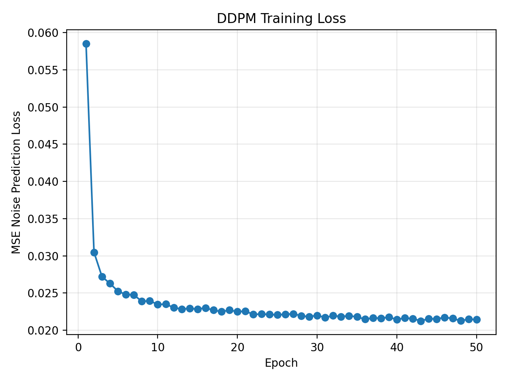
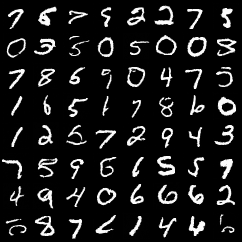

# 编程实战作业 2：DDPM 扩散模型生成 MNIST 图像实验报告

## 1. 实验目的

基于 PyTorch 实现一个 DDPM 扩散模型，在 MNIST 数据集上训练生成手写数字图像，并使用 FID-like 指标评估生成质量。

## 2. 方法简介

DDPM 包含前向扩散和反向去噪两个过程。前向过程逐步向真实图像加入高斯噪声；反向过程训练神经网络预测噪声，并从纯噪声逐步恢复出图像。

## 3. 实验设置

- 数据集：MNIST
- 图像尺寸：28×28
- 模型：简洁 U-Net
- 优化器：AdamW
- 损失函数：MSE 噪声预测损失
- 扩散步数：填写你的实际设置
- 训练轮数：填写你的实际设置

## 4. 实验结果

### 4.1 训练曲线

### 4.2 生成样例

### 4.3 FID 指标

DDPM MNIST FID-like Evaluation Report
====================================
Checkpoint: outputs/ddpm_mnist/ckpt_best.pt
Num samples: 1000
FID-like score: 0.009205

Note: This project uses a lightweight CNN feature extractor for classroom evaluation.
It is suitable for relative comparison in this assignment, but is not standard ImageNet Inception FID.

## 5. 结果分析

训练初期生成图像接近随机噪声；随着训练损失下降，生成图像逐渐形成数字轮廓。若训练轮数增加、扩散步数增大，通常可以得到更清晰的数字图像，但训练和采样耗时也会增加。

## 6. 总结

本实验完成了 DDPM 的核心流程，包括加噪、噪声预测、反向采样、生成结果保存和 FID-like 指标评估。
